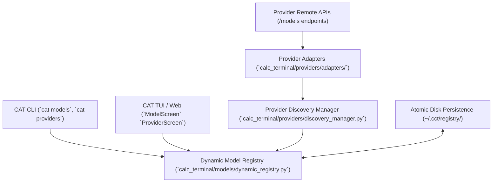

# CAT AI Provider Architecture (v2026.09)

## Overview

CAT (Coding Agent Terminal) features a universal, dynamic AI provider ecosystem designed to connect to 130+ LLM providers ranging from frontier cloud APIs (OpenAI, Anthropic, Google Gemini, Meta, Mistral, xAI) to first-class Chinese AI providers (DeepSeek, Alibaba Qwen, Moonshot Kimi, Zhipu GLM, MiniMax, Tencent Hunyuan, ByteDance Seed, Xiaomi MiMo, Baidu ERNIE) and local inference runtimes (Ollama, vLLM, LocalAI).

Unlike static systems with hardcoded model strings, CAT's v2026.09 architecture decouples provider identity, model catalogs, and live discovery into modular layers.

---

## Architectural Layers

### 1. Provider Registry (`providers.json`)
The foundational provider definitions are maintained in `calc_terminal/providers/providers.json`. Each entry defines:
- `id`: Unique lowercase provider identifier (e.g. `openai`, `deepseek`, `moonshot`).
- `name`: Human-readable display name.
- `url`: Default API endpoint base URL.
- `api_style`: Protocol dialect (`openai`, `anthropic`, `gemini`, `ollama`).
- `auth_key`: Environment variable or secret key name for authentication.
- `fallback_models`: Seed model list used prior to initial live discovery.

### 2. Provider Adapters (`calc_terminal/providers/adapters/`)
Modular adapter classes implementing `BaseProviderAdapter` handle provider-specific nuances:
- OpenAI, Anthropic, Gemini, Ollama, xAI, Mistral, Cohere.
- Chinese frontier adapters: DeepSeek, Alibaba, Moonshot Kimi, Zhipu GLM, MiniMax, Tencent, ByteDance, Xiaomi, Baidu.
- Generic OpenAI-compatible adapter for custom endpoints.

### 3. Provider Discovery Manager (`calc_terminal/providers/discovery_manager.py`)
A thread-safe singleton coordinator that:
- Executes non-blocking background polls on configurable intervals.
- Handles parallel discovery across providers with rate-limiting and timeouts.
- Manages connection health tracking (`online`, `degraded`, `offline`).
- Dispatches model discovery notifications when new AI models are detected.

---

## Multi-Endpoint Support

CAT supports multiple endpoints per provider family:
- **Hosted API vs Open-Weight Hosted**: Distinguishes proprietary APIs (e.g. OpenAI GPT-6 Astra) from open-weight hosted models (e.g. DeepSeek-R1 on Fireworks or Together).
- **Local vs Cloud**: In Ollama, models running on `localhost:11434` are categorized as `local`, while Ollama Cloud endpoints are categorized as `cloud`.

---

## Configuration & Credentials

Provider credentials are read from environment variables or encrypted configuration files:
- Never hardcoded in source code or committed to git.
- Masked in all logs, audit reports, and user interfaces (`sk-...1234`).
- Missing API keys transition the provider to `auth_required` rather than crashing discovery.
